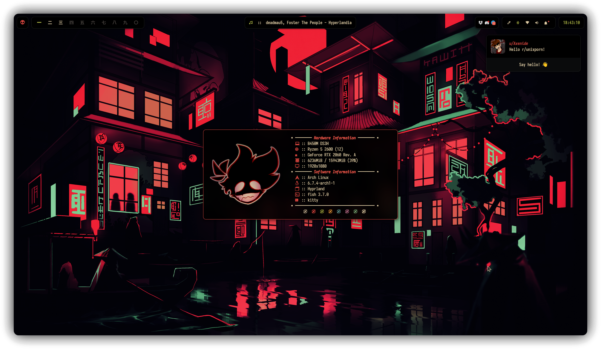

<h1 align="center">✨ Dotfiles</h1>

<p align="center">
    <i>These are my configuration files also known as <b>dotfiles</b>.</i>
    
</p>

> [!CAUTION]
> This setup is specific for [Hyprland](https://github.com/hyprwm/Hyprland). Dont install it if you don't know what you're doing.

## 📹 Check it out!
https://github.com/user-attachments/assets/d58ccfea-8101-4476-a6da-1c1d05d67796

> [!WARNING]
> The main branch is experimental, as I'm always making changes.
>
> Please refer to the [stable branch](https://github.com/Axenide/Dotfiles/tree/stable) if you want to use it.

## Installation
```bash
git clone https://github.com/Axenide/Dotfiles
cd Dotfiles
./dots.sh
```
This will execute the installation wizard.

> [!NOTE]
> [This packages](https://github.com/Axenide/Dotfiles/blob/main/pacman/packages.txt) are needed to fully use the config and will be installed if you choose the option in script:

Also it will install `yay`, but you can skip the installation and use any AUR helper you want and install them manually. 

## ⌨️ Keybindings

### Hyprland

| Keys                                         | Action                          |
|---------------------------------------------:|:--------------------------------|
| <kbd>SUPER + C</kbd>                                  | Close window                    |
| <kbd>SUPER + SHIFT + Esc</kbd>                     | Exit Hyprland                   |
| <kbd>SUPER + SHIFT + B</kbd>                                  | Toggle Waybar                     |
| <kbd>SUPER + ALT + B</kbd>                            | Restart Waybar                  |
| <kbd>SUPER + Space</kbd>                              | Toggle tiled/floating           |
| <kbd>SUPER + P</kbd>                                  | Toggle pseudo-tiling            |
| <kbd>SUPER + SHIFT + D</kbd>                                  | Toggle split                    |
| <kbd>SUPER + F</kbd>                                  | Fullscreen                      |
| <kbd>SUPER + SHIFT + F</kbd>                          | Fake Fullscreen                 |
| <kbd>SUPER + CTRL + F</kbd>                            | Maximize                        |
| <kbd>SUPER + Y</kbd>                                  | Pin window                      |
| <kbd>SUPER + G</kbd>                                  | Center window                   |
| <kbd>SUPER + Arrows or H,J,K,L</kbd>                  | Move window focus               |
| <kbd>SUPER + SHIFT + Arrows or H,J,K,L</kbd>          | Move tiled window               |
| <kbd>SUPER + CTRL + Arrows or H,J,K,L</kbd>        | Resize window                   |
| <kbd>SUPER + ALT + Arrows or H,J,K,L</kbd>            | Move floating window            |
| <kbd>SUPER + [1-9][0]</kbd>                           | Change workspace [1-10]         |
| <kbd>SUPER + SHIFT + [1-9][0]</kbd>                   | Move window to workspace [1-10] |
| <kbd>SUPER + Z</kbd>                                  | Go to previous workspace        |
| <kbd>SUPER + SHIFT + Z</kbd><br><kbd>SUPER + Scroll Down</kbd> | Go to previous active workspace |
| <kbd>SUPER + X</kbd>                                  | Go to next workspace            |
| <kbd>SUPER + SHIFT + X</kbd><br><kbd>SUPER + Scroll Up</kbd>   | Go to next active workspace     |
| <kbd>SUPER + Left Click</kbd>                         | Drag window                     |
| <kbd>SUPER + Right Click</kbd>                        | Drag resize window              |

### Programs

| Keys                                         | Action                          |
|---------------------------------------------:|:--------------------------------|
| <kbd>SUPER + RETURN</kbd>                             | Open Kitty terminal             |
| <kbd>SUPER + SHIFT + RETURN</kbd>                     | Open floating Kitty terminal    |
| <kbd>SUPER + ALT + RETURN</kbd>                       | Open Kitty with slurp           |
| <kbd>SUPER + E</kbd>                                  | File explorer                   |
| <kbd>SUPER + SHIFT + E</kbd>                          | Floating file explorer          |
| <kbd>SUPER + W</kbd>                                  | Zen Browser                         |
| <kbd>SUPER + SHIFT + W</kbd>                          | Private Zen Browser                 |
| <kbd>Print</kbd>                                      | Save and copy screenshot        |
| <kbd>SHIFT + Print</kbd>                              | Copy screenshot                 |
| <kbd>SUPER + SHIFT + S</kbd>                          | Copy area screenshot            |
| <kbd>SUPER + D</kbd>                                  | Toggle Dashboard                    |
| <kbd>SUPER + A</kbd>                                  | Talk with Alpha              |
| <kbd>SUPER + ,</kbd>                                  | Select wallpaper              |
| <kbd>SUPER + SHIFT + B</kbd>                          | Reload bar CSS              |
| <kbd>SUPER + ALT + B</kbd>                            | Restart bar              |

### Tmux

> [!IMPORTANT]
> **PREFIX** is set to <kbd>CTRL + Space</kbd>

| Keys                | Action                          |
|--------------------:|:--------------------------------|
| <kbd>PREFIX + c</kbd>        | Create window                   |
| <kbd>SHIFT + ALT + H,L</kbd> | Navigate windows                |
| <kbd>PREFIX + [1-9]</kbd>    | Change to window from 1 to 9    |
| <kbd>PREFIX + &</kbd>        | Kill window                     |
| <kbd>PREFIX + /</kbd>        | Vertical split                  |
| <kbd>PREFIX + -</kbd>        | Horizontal split                |
| <kbd>CTRL + H,J,K,L</kbd>    | Navigate panes                  |
| <kbd>PREFIX + { or }</kbd>   | Swap pane position              |
| <kbd>PREFIX + q</kbd>        | Go to pane pressing a number    |
| <kbd>PREFIX + x</kbd>        | Kill pane                       |
| <kbd>PREFIX + s</kbd>        | List sessions                   |
| <kbd>PREFIX + w</kbd>        | List windows                    |
| <kbd>PREFIX + [</kbd>        | Yank mode (copy)                |
| <kbd>v</kbd>                 | Start selection                 |
| <kbd>CTRL + v</kbd>          | Toggle rectangle/line selection |
| <kbd>y</kbd>                 | Yank selection                  |

## 🌐 Browser
I'm currently using [Zen Browser](https://zen-browser.app/) with some custom tweaks. To use my config you need to create a new profile and click on "Select folder". The folder will be located at `~/.zen/Zen/`.

If you just want good [Pywalfox](https://github.com/Frewacom/pywalfox/) support, install the [PywalZen](https://zen-browser.app/themes/d2953516-d239-4ef8-aac5-b238e3dc0360) theme I made!

> [!NOTE]
> I also modified some shortcuts to make them analog to the ones I use in Hyprland.

| Keys                | Action                  |
|--------------------:|:------------------------|
| <kbd>ALT + Z</kbd>  | Previous workspace      |
| <kbd>ALT + X</kbd>  | Next workspace          |
| <kbd>ALT + S</kbd>  | Toggle web panel        |

<p align="center">
<samp>
  <sup>
    <b>
    <i>Please consider giving me a tip. :)</i>
    <br>
    <a href="https://cafecito.app/axenide">☕ Cafecito</a> |
    <a href="https://ko-fi.com/axenide">❤️ Ko-Fi</a> |
    <a href="https://paypal.me/Axenide">💸 PayPal</a>
  </sup>
</samp>
</p>
